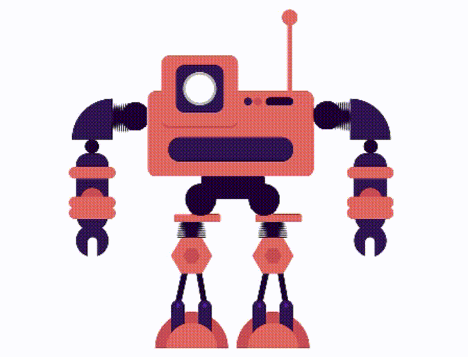
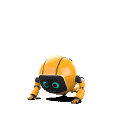

# Robot Leena

## **It is Raspberry Pi based Humanoid Robot**

<!--lint ignore double-link-->


<br/>

## It's made by team [robosouls](https://www.facebook.com/robosouls):

| Name               | Post               | Email                         |  
| ------------------ | ---------          | ----------------------------- |
| [**Shanjit Mondal**](https://www.facebook.com/shanjit.mondol.50) | [Circuit Designer](https://github.com/shanjit11) | shanjitmondal11@gmail.com       | 
| [**Jewel Nath**](https://www.facebook.com/dev.jewel.5/)     | [Programmer](https://github.com/DevJewel143)       | devjewel.cou.ict10@gmail.com  |  
| [**Mestu Paul**](https://www.facebook.com/mestu.paul.812)     | [Programmer](https://github.com/Mestu-Paul)       |paulmestu@gmail.com            |   


<!--lint ignore double-link-->



## Here we used:
1. **Raspberry Pi** as a cpu of our robot
2. **Servo Motors** for various hand's move
3. **DC Motos** for runing
4. **Ultrasonic Sensors** for count distance
5. **LED** for indicators
6. **LCD Display** for showing message
7. **Aluminium** sheet, **Aluminum** angle, **SS** for making robot body
8. **Makeup Mannequin** as a robot face

<!--lint ignore double-link-->


<br />


## It's able to -
* Take a cammand and replay accrding to command
* Hand's UP
* Hand Shake
* Salute
* Go forward and backword
* Turn left and right


<!--lint ignore double-link-->


## Programming Language and tools we used - 
| Python | C++ |  Bash | Terminal | Raspberry Pi |  Arduino |
| ------ | ----| ------| -------- | ------------ | --------- |
|||||||

<br />
<br />

## Servo move direcection:
### Servo Initial positions:
 
|servo no | position | Limitation |
| -----   | ------   | ---------- |
| 1 | 0   |  35 |
| 2 | 90  |  180| 
|3  | 20  | 0 |
|4  |  0  | 180 |
|5  | 180 | 140 |
|6  | 160 | 180 |
|7  | 170 | 180 |
|8  | 180 | 180 |
|9  |  60 | 180 |
|10 |   0 | 180 |
|11 |   0 | 180 |
|12 | 150 | 180 |
|13 |  -  | -   |
|14 |  -  | -   |
|15 |  -  | -   |
|16 |  -  | -   |
|17 |  -  | -   |
|18 |  -  | -   |
|19 |  -  | -   |
|20 |  -  | -   |
|21 |  -  | -   |
|22 |  -  | -   |

### salute

>start.

| pin | degree  |
| --- | ------  |
| 7	  |    0    |
| 3   |	  180   |
| 7	  |    80   |
| 6	  |    60   |

>normal

| pin | degree |
| --- | ------ |
| 7	  |  180   |
| 3   |	   0   |
| 6	  |  170   |

<br/>
<br/>

### Hug 

> start

| pin1 | degree	 | pin2	| degree |
| ---- | ------- | -----| -------|
| 7 |	0|	10	|180|
|3	|90	|4	|90 |
|2	|50 |	5	|150|
|7 |	50	| 10	|130|
|6	|90	|9	|90|

>stop

| pin1 | degree	 | pin2	| degree |
| ---- | ------- | -----| -------|
|7|	180|	10|	0|
|3	|0|	4|	180|
|2	|20	|5|	160|
|6	|170 |	9	|10|

<br/>
<br/>

### hand_shake 

>start

| pin |	degree |
| ----| ----   |
| 3	| 60 |
|7	|150|

>shake

```python
for i in range(0, 10):
    if i&1:
        pin 7 = 170
    else:
        pin 7 = 120
```

>normal

| pin |	degree |
| ----| ----   |
| 7	| 180 |
|3	| 0|

<br/>
<br/>

### hand's_up.py  

>start

| pin1 | degree	 | pin2	| degree |
| ---- | ------- | -----| -------|
|10|	180|	7|	0|
|5	|40	|2	|140|
|4	|90|	3|	90|
|10	|130|	7	|70|

>stop

| pin1 | degree	 | pin2	| degree |
| ---- | ------- | -----| -------|
|10	| 0 |	7 |	180 |
|4 |	180|	3|	0|
|5 |	160 |	2 |	20|


<br/>
<br/>


